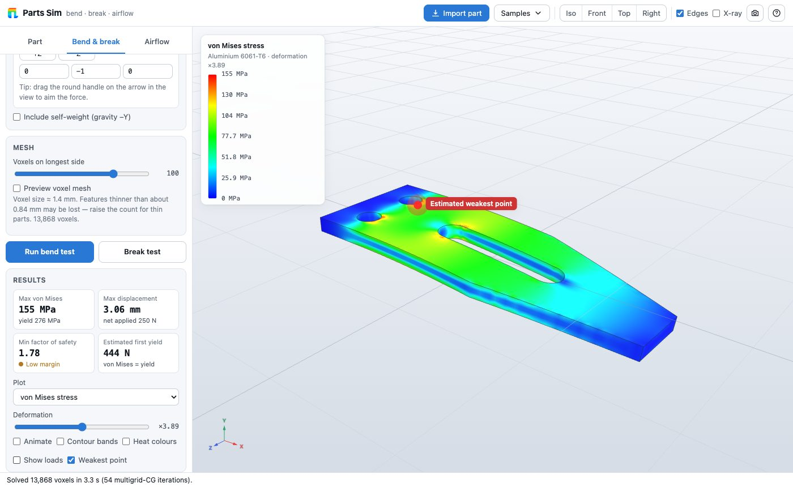
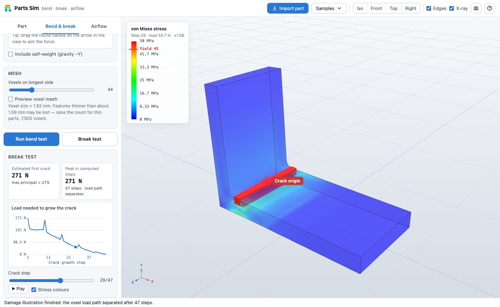
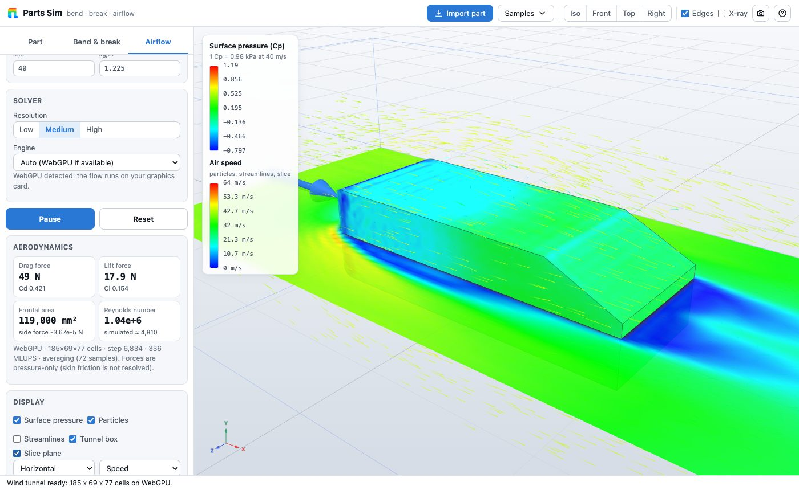

# Parts Sim

**Open-source structural, thermal and airflow simulation for your CAD parts: a desktop app for macOS, Windows and Linux.**

Open a SolidWorks, STEP, IGES, STL or OBJ part, click the faces you want to hold and push, and see where it
bends most and where it breaks first. The same setup runs the study types SolidWorks Simulation offers: linear and
nonlinear static, frequency, buckling, fatigue, drop test, linear dynamic and optimization, plus steady and
transient heat transfer. You can also put the part in a virtual wind tunnel and turn the aerodynamic pressure
into a structural load. Results use SolidWorks-style colour plots. Everything runs on your machine; nothing is
uploaded. The same app also runs in a web browser.



| Break test (crack growth in a 3D-printed PLA bracket) | Airflow (surface pressure and wake of a car body) |
|---|---|
|  |  |

## Features

- **Opens SolidWorks parts and assemblies** (`.SLDPRT`, `.SLDASM`) without SolidWorks. It also opens STEP / STP, IGES / IGS and BREP (via OpenCascade compiled to WebAssembly), plus STL, OBJ, 3MF, PLY and GLB. CAD faces are kept for click-selection, and the material assigned in SolidWorks is picked up when it is in the library.
- **Bend test (linear static FEA).** Pick fixed supports and forces or pressures by clicking faces or painting areas. Aim forces with direction buttons, typed vectors, or by dragging the arrow in 3D. Optional self-weight.
- **Colour-coded results.** Plots of von Mises stress, displacement, factor of safety, and max/min principal stress. Smooth or banded contours, rainbow or colour-blind-safe palette, a hover probe, and a marker on the weakest point with the load at which it first yields.
- **See how far it bends before it breaks.** Show the part at the applied load, at first yield or at the breaking load, drawn at true scale, or press **Bend until it breaks** to watch the load ramp up until the weakest point fails. Exaggerated deformation is available, but off by default.
- **Break test.** A progressive-damage run removes material wherever the stress reaches the tensile strength and re-solves, showing where the crack starts, how it runs through the part, and the load it takes to grow.
- **Nonlinear static.** Large deflection and metal plasticity: ramp the loads up to what you set, or until the part collapses, tears or cracks, with a load–displacement curve, plastic-strain plots and the permanent bend left after unloading.
- **Frequency.** Natural frequencies, animated mode shapes and effective mass along X, Y and Z, with fixtures or free-floating.
- **Buckling.** Buckling load factors and mode shapes, with a warning when the part would yield before it buckles.
- **Fatigue.** Life in cycles, damage and a fatigue safety factor from an S-N curve for the material, for fully reversed, zero-based or custom load cycles, with surface-finish and mean-stress corrections.
- **Drop test.** The part falls from a height onto a rigid floor; see the peak stress anywhere during the impact, the impact force and deceleration, and replay the impact.
- **Linear dynamic.** Frequency sweeps of vibrating loads or base shaking (resonance curves), shock pulses, sine bursts and a synthetic earthquake, with damping.
- **Optimization.** Topology optimization removes material that does little while keeping the part as stiff as possible (export the new shape as STL or load it as the part), and a material & size study finds the lightest or cheapest material and scale that keeps the safety factor.
- **Thermal.** Fixed temperatures, heat inputs and convection on picked faces; steady state or over time, with temperature and heat-flux plots.
- **Airflow.** A 3D lattice-Boltzmann wind tunnel with any wind direction and speed. It shows animated particles, streamlines, a slice plane and surface pressure, and reports drag, lift, Cd and frontal area. One click turns the surface pressure into a wind load for the bend test.
- **Desktop app.** Native menus and shortcuts, Open and Save dialogs, *Open With* from Finder or Explorer, opening files from the command line, and assemblies that find their part files in the same folder.
- **One material for the part**, picked on the Part tab and used everywhere: stiffness, strength, elongation and fatigue strength in the structural studies, conductivity and heat capacity in thermal, weight in airflow, and price in the material & size study. The library covers steels, aluminium, titanium, brass, copper, cast iron, PLA, PETG, ABS, nylon, polycarbonate, carbon fibre, wood and glass, or you can enter your own values.
- **Resize the part.** Scale it by a factor or set its longest side; fixtures and loads stay on the same faces.
- **Runs on the GPU.** Airflow, the structural solves (including the eigenvalue, nonlinear and optimization iterations) and the drop test's time stepping use the graphics card through WebGPU, and fall back to the CPU automatically.
- Seven **sample parts** with ready-made setups: beam, L-bracket, mounting bracket, wrench, crane hook, wing, and the Ahmed car body.

## Install

Download the installer for your system from the project's **Releases** page, or from the artifacts of the latest *Desktop app* workflow run:

| System | File |
|---|---|
| macOS, Apple silicon | `Parts Sim-<version>-arm64.dmg` |
| macOS, Intel | `Parts Sim-<version>.dmg` |
| Windows 10/11 (x64 or ARM) | `Parts Sim Setup <version>.exe`, or the portable `-win.zip` |
| Linux (x64) | `Parts Sim-<version>.AppImage` (`chmod +x`, then run), or `parts-sim-<version>.tar.gz` |

The builds are not code-signed yet, so the first launch needs one extra step:
- **macOS:** right-click the app, choose **Open**, then confirm.
- **Windows:** choose **More info ▸ Run anyway**.

## Opening SolidWorks files

SolidWorks saves a display mesh inside every part and assembly, one set of triangles per face, and Parts Sim reads that mesh. The exact geometry inside the file (the Parasolid B-rep) needs the licensed Parasolid kernel, so it is not used.

- **Parts (`.SLDPRT`)** from SolidWorks 2015 or newer open directly, with their faces and assigned material.
- **Assemblies (`.SLDASM`)** use each component's cached mesh when the file has one. Otherwise each component is read from its own part file, so keep the parts in the same folder. The desktop app finds them automatically; in a browser, select the assembly and its parts together.
- **Toolbox fasteners and other multi-configuration parts** are left out, with a message, when their part file is saved at a different size than the assembly uses.
- **Not readable:**
  - Files saved by SolidWorks 2014 or older.
  - Parts saved with *Options ▸ Document Properties ▸ Image Quality ▸ Save tessellation with part document* turned off.
  - Drawings (`.SLDDRW`).

  For these, the app says so and suggests **File ▸ Save As ▸ STEP AP242** in SolidWorks.

The mesh is SolidWorks' display tessellation, so its accuracy follows the part's *Image Quality* setting. That is fine for voxel-based simulation, but it is not exact CAD geometry.

## Quick start (from source)

Requires Node.js 20.19+ or 22.12+.

```bash
npm install
npm run desktop    # build and start the desktop app
npm run dev        # or run it in a browser: open the printed URL
```

Open a sample from **File ▸ Open Sample** (or the **Samples** button), or open or drop a file, then:

1. **Part tab.** Check the size and units (STL and OBJ have none; mm is the default). Rotate the part if it was modelled Z-up.
2. **Structural tab.**
   - Pick a material (Part tab) and a **study**: linear static, nonlinear, frequency, buckling, fatigue, drop test, linear dynamic or optimization.
   - Click **+ Fixed support** and click the faces to hold. Press Enter when done.
   - Click **+ Force**, click the faces to push, and set the magnitude and direction. Drag the round handle on the purple arrow to aim it.
   - Press the run button (⌘R / Ctrl+R), then switch plots, scrub steps or modes, or hover to probe values.
   - In the linear static study, **Break test** (⇧⌘R / Ctrl+Shift+R) shows the crack growing step by step.
3. **Thermal tab.** Add fixed temperatures, heat power or convection on faces (other faces cool in still air by default), choose steady state or over time, and press **Run heat transfer** (⌘T / Ctrl+T).
4. **Airflow tab.** Set the wind direction and speed and press **Run airflow**. Once the status says *averaging*, press **Use as load in bend test**.

### Building the installers

```bash
npm run dist:mac      # .dmg and .zip for Apple silicon and Intel
npm run dist:win      # .exe installer and portable .zip
npm run dist:linux    # .AppImage and .tar.gz
```

Output goes to `release/`. Build each installer on its own operating system; the GitHub Actions workflow in `.github/workflows/desktop.yml` does this and tests the app on all three.
- **macOS builds** are ad-hoc signed. For public releases, set up a Developer ID and notarisation (see the electron-builder docs).
- **Project in an iCloud Drive folder** (such as a synced Documents folder): macOS adds file-provider metadata that `codesign` rejects. Build into a non-synced folder, for example `npm run dist:mac -- --config.directories.output=/tmp/parts-sim-release`.

For the browser version, run `npm run build` and serve the static `dist/` folder (it works from a sub-path, such as GitHub Pages). WebGPU airflow needs Chrome/Edge 113+, Safari 26+ or another WebGPU-capable browser; otherwise the CPU engine is used with a coarser grid.

### Native C++ app

`native/` holds a native C++ edition built with Qt, OpenCascade and wgpu-native. It has the same studies and results as the Electron app, and its CPU solvers are about 10× faster. See [native/README.md](native/README.md) for build instructions.

## How it works

### Structural solver (`src/fea`)

- The part is **voxelised** by supersampled ray casting with a majority vote across X, Y and Z, which tolerates small holes and flipped triangles. Each voxel's filled fraction scales its stiffness, which smooths the staircase on curved surfaces.
- **Thin walls** (sheet metal, channels, enclosures) are measured by ray casting through the part. Walls thinner than about 1.5 voxels become a connected layer of voxels that holds exactly the wall's volume, so they neither vanish nor break apart when they run diagonally through the grid. Their in-plane stiffness and stress match the real wall; bending of the wall itself is approximate, so the automatic resolution still aims for about two voxels through every wall.
- Each voxel is an **8-node hexahedron with Wilson incompatible modes**. The condensed 24×24 matrix removes the shear locking of plain bricks, so bending is accurate even with only 2–4 voxels through a wall.
- `K u = f` is solved **matrix-free with conjugate gradients preconditioned by a geometric multigrid V-cycle** with degree-2 Chebyshev smoothing. The coarse levels are exact Galerkin products, and the coarsest level uses a dense Cholesky factorisation. Inside uniform regions the matrix product uses the assembled 27-point stencil (243 multiply-adds per node instead of 576). Typical runs take 10–40 iterations, so a 65,000-voxel model solves in about 1–3 s on the CPU.
- **On the GPU** (`src/fea/gpu-solver.js`, the same shader as the native app), the whole CG loop runs as WebGPU compute shaders:
  - the matrix-free product uses one thread per grid node, gathering from its 8 voxels (the stencil inside uniform regions), from neighbour differences so that 32-bit floats keep their accuracy;
  - the V-cycle fuses the Chebyshev smoothing into the products, then restriction, prolongation and a dense coarsest inverse;
  - dot products and the CG scalars stay on the GPU.

  GPUs compute in 32-bit floats. Reliable updates keep 64-bit accuracy: whenever the GPU's residual has dropped tenfold, its solution is added to a 64-bit one on the CPU and the true residual, computed there, replaces the GPU's. Results match the CPU solver to about 10⁻⁷.
- **Stresses** are evaluated at element corners (including the condensed modes) and averaged at the nodes, then interpolated onto a refined copy of your surface mesh for display.
- The **break test** is a brittle progressive-damage model. At each step the voxels at the peak of the failure measure (von Mises for ductile materials, max principal stress for brittle ones) are removed where they reach the ultimate tensile strength, fragments that detach are dropped, and the model is re-solved.

### Other structural studies (`src/fea`)

- **Frequency and buckling** (`eigen.js`) use LOBPCG, a block eigen-solver that only needs matrix products and a preconditioner. The multigrid solve above (on the GPU when available) is the preconditioner, so a handful of modes converge in a few dozen iterations. Mass is lumped per node. Free-floating parts are solved as K + sM with a tiny shift s, and their six rigid-body modes are skipped. Buckling uses the geometric stiffness of the pre-stressed model: K x = −λ K_G x.
- **Nonlinear static** (`nonlinear.js`) uses co-rotational voxels: each voxel's rigid rotation comes from the polar decomposition of its mean deformation gradient, and the small strain that is left is resisted by the same incompatible-mode element, so bending stays accurate at large rotations. Plasticity is von Mises (J2) with linear hardening from the yield strength to the tensile strength at the elongation at break, integrated at the 8 Gauss points of every voxel by radial return. Equilibrium comes from Newton iterations with the consistent tangent plus stress stiffness, solved by flexible CG preconditioned with the elastic multigrid. Load increments adapt; the ramp stops at collapse (stiffness below 3% of the initial value), tearing (plastic strain at the elongation), cracking (brittle materials), or gross bending (displacement over 15% of the part size).
- **Fatigue** (`fatigue.js`) is stress-life. The S-N curve is a Basquin line through 0.9·UTS at 10³ cycles and the material's fatigue strength, which is reduced by a Marin surface-finish factor for metals. Mean stress uses the Goodman correction, applied to the equivalent stress (von Mises signed by the dominant principal stress).
- **Drop test** (`explicit.js`, `gpu-explicit.js`) is explicit central-difference dynamics with lumped mass, penalty contact against a rigid floor, and slight stiffness-proportional damping. The time step comes from the highest natural frequency, found by power iteration. On the GPU the whole time loop, including stress recovery and the floor-force sum, runs in compute shaders.
- **Linear dynamic** (`response.js`) is modal superposition with the mode-acceleration correction. The modes that were not computed still contribute their static share through one extra static solve. Harmonic responses are exact per mode, and transient responses are integrated per mode with average-acceleration Newmark.
- **Topology optimization** (`topology.js`) is SIMP (penalty 3) with a density filter and optimality-criteria updates, one warm-started multigrid solve per iteration. Voxels at fixtures and loads are kept. The result is meshed with surface nets (`core/isosurface.js`) for display and STL export.
- **Material & size** optimization uses linearity. Each load group (forces, pressures, self-weight) is solved once, and for a geometric scale s and a material, stresses scale as σ_F/s² + σ_P + σ_G·s·ρ/ρ₀, and displacements also with 1/E.

### Thermal solver (`src/fea/thermal.js`)

One temperature per grid node, 8-node conduction bricks scaled by the voxel fill fraction, lumped heat capacity, convection terms on the surface nodes from the picked faces' true area, and backward-Euler time steps. Each system is solved by CG with a scalar geometric-multigrid V-cycle (Galerkin coarse levels, the same scheme as the structural solver).

### Airflow solver (`src/cfd`)

- **D3Q19 lattice Boltzmann** with BGK collision and a **Smagorinsky** sub-grid model (a simple LES). It runs as a WGSL compute shader, unrolled over the 19 directions and storing the populations in 16 bits where the GPU supports it (shifted by their rest weights, as in FluidX3D: half the memory traffic, drag within 0.1% of 32-bit storage), at about 1,100–1,300 million cell updates per second on an Apple-silicon GPU, with an identical JavaScript fallback in a Web Worker.
- **Interpolated (Bouzidi) bounce-back.** Each wall link's exact distance comes from ray casting against your mesh (via three-mesh-bvh), so curved surfaces are not treated as staircases.
- **Boundaries.** A velocity inlet, and open pressure boundaries on the outlet and all four sides, so displaced air escapes as it would in open air rather than being squeezed as in a closed tunnel.
- **Forces** are the time-averaged pressure integrated over the wetted voxel faces (pressure drag and lift). Skin friction is not resolved.
- **Grid size** is a slider, from 50 thousand cells up to what your GPU's memory holds (tens of millions of cells on a recent GPU; the CPU engine stops at 1 million). Next to it the panel shows the tunnel's dimensions and the memory it needs. After a run, it also estimates how long the flow takes to develop at that size.

### Desktop shell (`electron`)

The desktop app is Electron: the same app, served from a private `app://` scheme with a strict content security policy, plus native menus, dialogs, file associations and a small preload bridge. The page gets no Node.js access. The shell only reads files the user opens, plus `.SLDPRT` files sitting next to an opened assembly.

## Validation

All figures are reproducible. The FEA and voxeliser numbers come from `npm test`; the airflow numbers come from the WebGPU engine at the stated resolution.

| Case | Parts Sim | Reference |
|---|---|---|
| Cantilever tip deflection, 2 / 4 / 8 voxels through the thickness | 1.3% / 1.0% / 0.8% error | Timoshenko beam theory |
| Cantilever mid-span surface bending stress | 30.00 MPa | 30.00 MPa (M·c/I) |
| Beam sample (200×20×10 mm steel, 800 N tip load), tip deflection | 1.54 mm | 1.60 mm (beam theory) |
| Beam sample, tip deflection at 40–128 voxels on the long side | within 6% at every resolution | beam theory |
| 1 mm wall in 1.56 mm voxels, bent in its plane, at 0° / 30° / 45° to the grid | deflection 0.99 / 1.00 / 0.95×, stress 0.99 / 1.05 / 1.00× | beam theory |
| GPU solver against the CPU solver (samples, both solved to a 10⁻⁶ residual) | 10⁻⁸–10⁻⁷ relative difference | CPU multigrid solver |
| Voxelised sphere volume | −0.12% | exact |
| Sphere drag, D = 100 mm at 20 m/s (medium) | Cd 0.37 | 0.40–0.47 (subcritical) |
| Ahmed body, 25° slant (medium / high) | Cd 0.48 / 0.42 | 0.285 (Ahmed et al., 1984) |
| NACA 2412 wing, aspect ratio 3, 6° (medium) | CL ≈ 0.04 | ≈ 0.5 |
| Cantilever, first bending frequency (2 voxels through the thickness) | 814.6 Hz | 815.4 Hz (Euler–Bernoulli) |
| Free-free bar, first flexible frequency (L/b = 10) | 4948 Hz, 6 rigid modes found | 5188 Hz (Euler–Bernoulli; shear lowers it a few %) |
| Clamped column, buckling load factor | 10.31 | 10.28 (Euler, π²EI/4L²) |
| Cantilever at PL²/EI = 1, tip deflection | 0.3006 L | 0.3017 L (elastica); 0.333 L linear |
| Cantilever plastic collapse, 4 voxels through the thickness | 1.05–1.23 × P_lim (collapse detected, including hardening) | P_lim = σ_y·b³/4L |
| Cooling fin, tip temperature | 82.785 °C | 82.786 °C (fin equation) |
| Heated insulated bar, mean temperature after 60 s | exact to 10⁻⁶ °C | Q·t / (ρ c V) |
| Steel bar dropped 1 m end-first: contact time / peak force | 41.2 µs / 18.6 kN | 39.6 µs / 17.6 kN (1D wave theory) |
| GPU drop test against the CPU one | within 1–2% (peak stress, force, contact time) | CPU explicit solver |
| Single mode: harmonic response, step-load overshoot | exact to 10⁻³ | analytical |

## Limitations

Treat Parts Sim as a design-comparison and learning tool, not a certified analysis.

- **Structural.** Stresses right at fixture edges and point-like loads are singular, as in any FEA, so judge peaks there with care. There is no contact between parts, and no thermal stress yet (thermal and structural studies are separate). Walls thinner than a voxel are kept as connected layers: their stiffness along the wall is right, but bending of the wall itself (for example a sheet-metal flap pushed flat) is too stiff and its stress too low. The Results panel says when this applies; raise the voxel count until the note disappears. If much of a part ends up unconnected to the fixtures, the app marks the results as not reliable instead of showing them.
- **Break test.** A brittle damage illustration. It shows where cracks start and roughly how they run, but it ignores plasticity, crack-tip physics and dynamics. Treat its loads as rough indications (use the nonlinear study for ductile parts).
- **Nonlinear.** Plasticity is isotropic hardening under monotonic loading (no cyclic plasticity, creep or necking). The collapse load of beams is typically 5–20% high, depending on how many voxels span the section. Runs take seconds to minutes, so start with the coarse mesh the study suggests.
- **Fatigue, drop, dynamic.** Fatigue is stress-life (high-cycle), not strain-life, and the library's S-N data are typical values, so use your supplier's data for critical parts. The drop test's floor is rigid and frictionless and the part stays elastic (it shows where it would dent or crack, not how far). Linear dynamic assumes small vibrations and modal damping.
- **Buckling.** Linear (eigenvalue) buckling of a perfect part. Real parts with imperfections often buckle at 50–80% of the computed load.
- **Optimization.** Topology results are concept shapes on the voxel grid. Re-model them in CAD and check them with a static study.
- **Airflow.** The grid is uniform and only a few million cells at most, so thin boundary layers are not resolved:
  - Drag of bluff shapes (blocks, spheres, brackets, and structures in wind) is typically within 10–30% of wind-tunnel data.
  - Streamlined bodies are over-predicted.
  - Lift on thin wings is strongly under-predicted.
  - The simulated Reynolds number is capped for stability; the app reports both the real and the simulated value.

## Project structure

```
electron/   desktop shell: window, menus, file opening, app:// protocol, preload bridge
build/      app icon and packaging hook
src/
  core/     importers (STEP via occt-import-js, SolidWorks reader), mesh processing, voxeliser, materials, samples
  fea/      hex element, multigrid FEA solver (CPU and WebGPU), eigen-solver, nonlinear, explicit dynamics,
            fatigue, modal superposition, topology optimization, thermal solver, worker and study plumbing
  cfd/      LBM on CPU and WebGPU, wall links, forces, airflow study and visualisation
  viewer/   three.js viewport, picking, colour maps
  ui/       panels, picker, legend, chart
test/       unit and regression tests (node --test)
scripts/    browser and desktop end-to-end tests (Playwright)
```

## Testing

```bash
npm test                 # solver, study, voxeliser, importer, SolidWorks and LBM tests
npm run build
npm run test:browser     # web app end to end in headless Chromium (needs Playwright's browser)
npm run test:studies     # every structural study and heat transfer in the browser, with screenshots
npm run test:desktop     # desktop app end to end: SolidWorks assembly from the command line, STEP, menus, GPU vs CPU bend test, frequency, drop test, thermal, airflow
```

The SolidWorks tests build synthetic files, so every header field is written deliberately, and the repository ships no one else's CAD. The reader was also checked against real parts and assemblies published in open-hardware projects. Triangle counts and extents matched the reference implementation exactly, and a 76-component assembly was checked against the preview image SolidWorks saved in it.

## Contributing

Issues and pull requests are welcome. Please run `npm test` (and `npm run test:browser` for UI changes) before opening a PR. If you change a solver, add or update a regression test that compares against a known solution.

Good first areas:
- Local grid refinement for the airflow solver.
- Thermal stress (temperatures from the thermal study as a structural load).
- Contact between assembly components.
- Reading SolidWorks files saved by versions before 2015.

## License

[MIT](LICENSE). Third-party components and their licences are listed in [THIRD_PARTY_NOTICES.md](THIRD_PARTY_NOTICES.md). STEP and IGES import uses occt-import-js / OpenCascade (LGPL-2.1), loaded as a separate WebAssembly module. SolidWorks is a trademark of Dassault Systèmes; Parts Sim is not affiliated with or endorsed by Dassault Systèmes.
