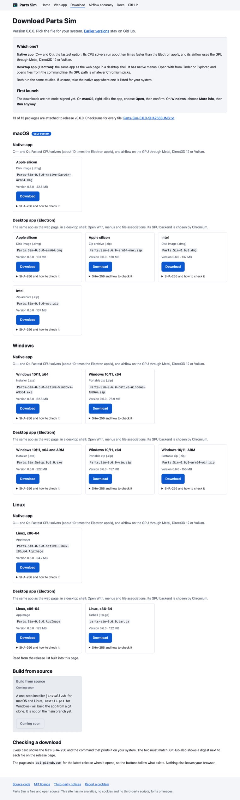
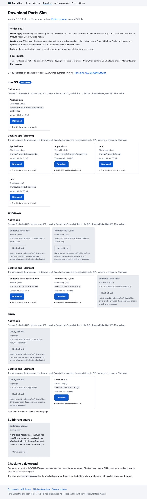
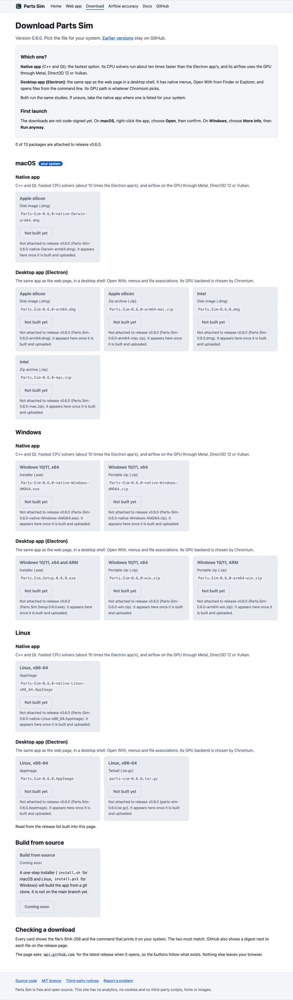
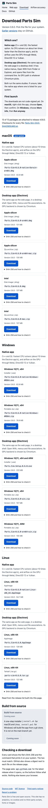
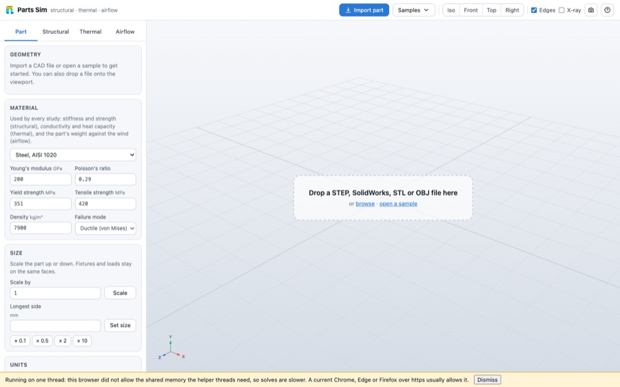
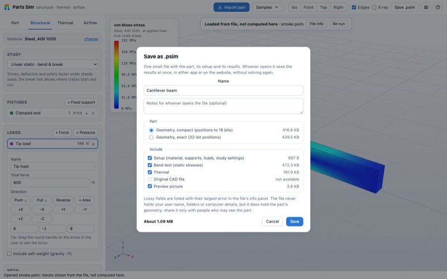
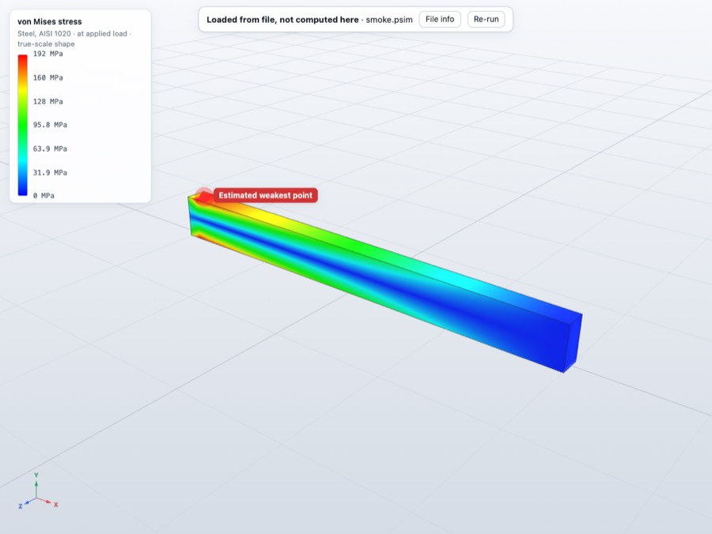
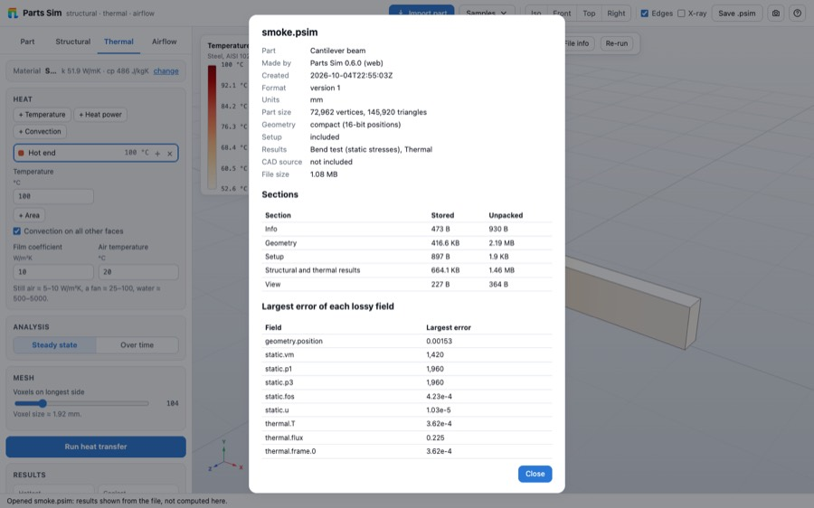
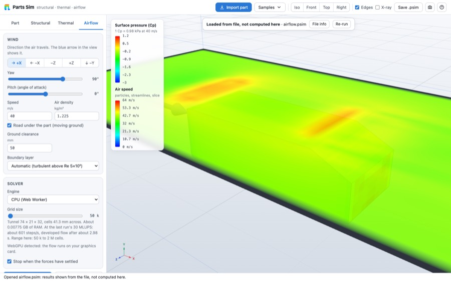

# The website and the .psim file: what was built, and how it measured

Branch `feature/website-psim`. This report covers brief sections B (the shareable `.psim` file) and C1
(the GitHub Pages website). Nothing here is deployed or released: the site goes live from `main` after the
owner's approval, and the airflow accuracy work is integrated separately.

## What was built

### The website (`site/`, `scripts/build-site.mjs`, `.github/workflows/site.yml`)

- `node scripts/build-site.mjs` builds `_site/` in about 5 s: the landing page `/`, the web app `/app/`
  (the normal vite build), the docs `/docs/` (`airflow-accuracy.md` and `psim-format.md` rendered from the
  repository's Markdown, whatever is on the branch at build time) and `/download/`. Every link is relative, so
  it works under `/parts-sim/`. No analytics, cookies, trackers, CDN links or third-party fonts; the pages carry a
  strict content security policy.
- **The web app on Pages.** Pages cannot send the COOP/COEP headers that the helper threads need, so
  `/app/` loads a vendored copy of coi-serviceworker (MIT, licence and notice kept in
  `THIRD_PARTY_NOTICES.md`). A second small script shows "Running on one thread" when the browser still does not
  allow shared memory. The app opens `.psim` files by drag and drop and the Open button.
- **The download page.** 13 package cards (native and Electron; macOS, Windows, Linux), drawn from
  `downloads.json`, which `build-site.mjs` makes from the latest release's real assets (`gh release view`), with a
  committed seed (`site/downloads.seed.json`, the 0.6.0 assets) as the offline fallback. A button is live only when
  its file is in the release; otherwise the card is greyed, has no `href`, says "Not built yet" and gives the
  reason on hover and in text. Each live card shows version, file name, size, SHA-256 and the command to check it
  on that system. The visitor's system is listed first. The page also asks `api.github.com` for the latest release
  and falls back to the built-in data. A "Build from source" card says "coming soon" until `install.sh` exists on
  `main`, then turns live by itself.
- **`site.yml`.** Builds on pushes to `main` that touch the site, the docs or the web app, on manual runs, and on
  published releases (a release starts a run on `main`, because Pages rejects deployments from a tag).
  Deploys only from `main`; Linux runners only; `pages: write` and `id-token: write` on the deploy job only; pull
  requests build and link-check but never deploy.

### The .psim file (`docs/psim-format.md`)

One binary file with a part, its setup and its results, readable by the web app, the Electron app, the website and
the native app, without solving again. The specification is [psim-format.md](psim-format.md).

- **Container.** PNG-style magic (catches text-mode damage), a version and a "needs at least" version, a section table
  (id, codec, offset, stored and unpacked length, CRC-32), a header CRC, and a trailer with a whole-file CRC and
  length. Each section is compressed on its own (deflate-raw), so the info and the thumbnail are read without
  unpacking the rest; unknown sections are skipped.
- **Sections.** INFO (JSON, with the largest error of every lossy field), THMB (JPEG preview), GEOM (the built
  part), CADS (the original CAD bytes, off by default), SETP (JSON: material, fixtures, loads, study settings, thermal
  and airflow setup), RFEA (structural and thermal results), RAIR (airflow results), VIEW (camera, plot, tab).
- **Coding.** Geometry: positions quantised to 16 bits per axis over the bounding box (or exact float32), delta coding,
  triangle corners delta-coded, byte planes, deflate. Fields: 16- or 8-bit quantisation over the field's min/max,
  prediction (3-D Lorenzo on grids, previous value or, for three-vectors, the same component of the previous
  vertex), byte planes, deflate. No new dependency: `CompressionStream('deflate-raw')` in the browser and Node,
  zlib in the native app.
- **In the apps.** Save as .psim (Ctrl/Cmd+S, the toolbar, the File menu) with a dialog listing what to include
  and the compressed size of each part, live; Open, drag and drop, command line, Finder/Explorer "Open With"; a banner
  "Loaded from file, not computed here" with a File info panel (sections and sizes, the app and version that
  wrote it, every lossy field's largest error) and **Re-run**, which solves again and says how the new numbers differ
  from the file's. The privacy sentence is in the save dialog. Electron: file association (`.psim`, role Editor,
  MIME `application/x-parts-sim`).
- **Results stored (web and Electron):** bend test, break test, nonlinear, frequency, buckling, fatigue, drop test,
  topology and material-and-size optimization, thermal, airflow. Not stored: the linear dynamic study (its modal
  basis is large; Re-run recomputes it).
- **Tools.** `node scripts/psim.mjs inspect|verify|to-stl|forces|dump|fixtures <file>`; `node scripts/psim-sizes.mjs`
  prints the size ladder.

### The native app

The Qt/C++ app has the same reader and writer (`native/src/core/psim.cpp`, no Qt), a `psim_tool` command-line tool,
and in the app: Save as .psim, open (menu, toolbar, drop, argument, Finder), the banner, File info, Re-run, and
the setup, the static result and the thermal result. See *What is not done*.

## Measured against the brief's targets

All on the M5 MacBook, `-O3` for native. The Windows PC was not involved.

| Target (brief) | Measured | Met |
|---|---|---|
| Geometry section at most 25% of the binary STL, exact positions | 5.0-10.6% of the STL of the same built part, 7 sample parts | yes |
| Geometry section at most 10% with quantised positions | 3.0-7.8% | yes |
| Airflow result including the viewing data under 5 MB for a 1M-cell run | 7.95 MB of arrays, **2.52 MB** in the file (Ahmed body, 963k-cell grid, 1:1 coarse grid) | yes |
| Writing and reading a typical file under 1 s | web app: write 133 ms (2 ms prepare, 131 ms compress and write), open 292 ms (read 53 ms, rebuild part 90 ms, install 116 ms) for a 73k-vertex part with static and thermal results; native core: read 3-20 ms, write 19-151 ms (26k-140k vertices); native app: open 232-617 ms, save 93-928 ms | yes |
| A file written by one app opens in the other app and on the website with identical numbers | JS file in the native app and native file in the web app: same maximum von Mises (245,581,056 Pa = 246 MPa, 1.57 mm), same thermal range; the two readers' `dump` output is identical on all 7 sample parts and both fixtures. The website's `/app/` opens files (checked) | yes, for what both apps store (see below) |

### The size ladder

Geometry, KiB, built sample parts (`node scripts/psim-sizes.mjs`). The apps store the *built* mesh, which the
importer has refined (the 12-triangle beam sample becomes 146k triangles), so these parts are larger than their
source files. The binary STL column is the STL of that built mesh.

| part | vertices | triangles | binary STL | JSON | binary | +quantise | +predict and deflate | +byte planes and deflate (file) | exact, deflated | file / STL (compact) | file / STL (exact) |
|---|---|---|---|---|---|---|---|---|---|---|---|
| beam | 72,962 | 145,920 | 7,125 | 3,891 | 2,565 | 2,138 | 723 | 407 | 415 | 5.7% | 5.8% |
| lbracket | 140,034 | 280,064 | 13,675 | 8,940 | 4,923 | 4,103 | 1,443 | 864 | 1,040 | 6.3% | 7.6% |
| bracket | 95,266 | 190,540 | 9,304 | 6,760 | 3,349 | 2,791 | 1,151 | 729 | 986 | 7.8% | 10.6% |
| wrench | 41,118 | 82,232 | 4,015 | 2,867 | 1,446 | 1,205 | 449 | 297 | 402 | 7.4% | 10.0% |
| hook | 26,490 | 52,976 | 2,587 | 2,314 | 931 | 776 | 250 | 77 | 129 | 3.0% | 5.0% |
| wing | 105,630 | 211,256 | 10,315 | 8,317 | 3,714 | 3,095 | 1,186 | 633 | 891 | 6.1% | 8.6% |
| ahmed | 123,460 | 246,916 | 12,057 | 9,637 | 4,340 | 3,617 | 1,334 | 726 | 875 | 6.0% | 7.3% |

Fields, KiB, the 73k-vertex beam with static and thermal results (before the stride-3 prediction was added for the
displacement field):

| array | JSON | float32 | float32 deflated | q16 | q16 deflated | + prediction | + byte planes (file) |
|---|---|---|---|---|---|---|---|
| static.vm | 658 | 285 | 177 | 143 | 118 | 93 | 82 |
| static.p1 | 737 | 285 | 159 | 143 | 103 | 77 | 69 |
| static.u (3 per vertex) | 4,575 | 855 | 398 | 428 | 295 | 382 (stride 1) | 316 (stride 1) |
| static.u with stride 3 | | | | | | 178 | **154** |
| thermal.T | 1,280 | 285 | 151 | 143 | 115 | 75 | 60 |
| all 8 arrays | 11,775 | 2,850 | 1,491 | 1,425 | 1,066 | 754 (stride 3 for u) | 645 (stride 3 for u) |

The stride-3 prediction halved the displacement arrays (316 to 154 KiB) and cut the stored fields by 20% (806 to 645 KiB).

Airflow, the Ahmed body, CPU engine: 50k cells 213 KB in the file (647 KB of arrays); 963k cells 2.52 MB (7.95 MB of
arrays: the Cp per vertex 247 KB, and four 1.9 MB velocity and density arrays, 16-bit).

Largest errors (written into every file's INFO and shown in the File info panel): positions at most
`(box size) / 131,070` per axis (0.0015 mm on the 200 mm beam); 16-bit fields at most `(max - min) / 131,068` of their
own range; the 8-bit density of the topology study at most 0.2%.

## Checks that ran

- **Site (on the Mac, Chrome for Testing):**
  - link check: 7 pages, 95 internal references, nothing loaded from another site;
  - download page in three states (all built 13 of 13, some missing 8 of 13, none 0 of 13): greyed cards have no `href`,
    `aria-disabled`, "Not built yet"; light, dark and phone width (no sideways scroll); the visitor's own system is
    listed first;
  - `/app/` served under `/parts-sim/` by a plain static server: the service worker gives cross-origin isolation, and
    without it the app opens and says "Running on one thread";
  - `scripts/browser-smoke.mjs` against the built `/app/`: passes;
  - `scripts/psim-smoke.mjs` against the built `/app/`: a `.psim` file saved and opened on the website passes.
- **Format and safety (`npm test`, 22 tests in `test/psim.test.js`, 3 s):** every section round trips, exact and
  quantised; 300 truncation points, 400 flipped bits, header lies about counts and lengths with the checksums repaired,
  a 64 MiB decompression bomb stopped in 1.2 s, section-internal count lies, a 600-case fuzz run in 1.5 s: none crashes,
  hangs or throws anything but a `PsimError`. Fixtures for each format version are kept (`test/fixtures/psim/`).
  The native reader has the same tests (`test_psim`, 30 tests, 5 s) and passed a 40,000-case fuzz run under
  AddressSanitizer and UBSan.
- **Apps:** `npm test` 88 of 88 (it includes the 22 psim tests); `npm run build` passes.
  Browser smokes: `psim-smoke.mjs` (bend test and thermal saved, a fresh page opens them: same card and legend text,
  picture difference 0.58 of 255; the Save dialog and a download; the file input; a cut file is refused with "damaged"
  and leaves the open part alone; Re-run reports -0.0% on max von Mises), `psim-app-smoke.mjs` (frequency study 0.76 of
  255, airflow 1.03 of 255, cards and legends identical), `psim-studies-smoke.mjs` (nonlinear, frequency, buckling,
  fatigue, drop, topology, sizing at the study level, picture difference 0.000-0.037), `psim-airflow-smoke.mjs`
  (airflow at 50k and 1M cells: card text identical, Cp error 7.5e-5 within its bound, streamline vertices identical).
- **Native:** `native/tests/psim_cross.py`: both directions, all 7 sample parts and the fixtures, `dump` identical;
  `native/tests/psim_app.py` (the real app with `PARTS_SIM_SCRIPT`): 10 of 10.

## Screenshots

| | |
|---|---|
|  |  |
| All 13 packages in the release | 8 of 13: native Windows and Linux, one AppImage and one ARM zip greyed |
|  |  |
| None built | Phone width |
|  |  |
| `/app/` when the browser blocks the service worker | Save as .psim, with sizes |
|  |  |
| Results loaded from a file | File info |
|  | |
| Airflow loaded from a file | |

## What is not done, and why

- **Deploying the site.** Held until the airflow fixes are integrated and `.psim` is complete, so that the live accuracy page
  shows good numbers (the owner's decision). The branch is pushed; `site.yml` deploys only from `main`.
- **Native app, results other than static and thermal.** NATIVE_STATUS
- **Linear dynamic results** are not stored in either app (version 1): the modal basis is large, and Re-run recomputes it.
- **Break test, loaded from a file:** the voxels that show cracks are placed using the nearest surface vertex's displacement,
  because the voxel grid's node displacements are not stored (they would be tens of megabytes). The deformed part and the
  stress colours are exact.
- **Native study options** (SETP `options`) are written empty; the native studies have no options model to save. A native
  file opened in the web app shows the web app's defaults for those.
- **Cross-app limits:** the native thermal and static meta carry the keys the native result has; the web importer
  fills the rest (the thermal history comes from the frame times). A native GPU engine choice is saved as "auto".
- **Windows and Linux native builds** of the `.psim` code were not tried (no machine; the NSIS file association is
  written but untested). The AppImage cannot register a MIME type by itself. The ZIP packages associate nothing.
- **Lighthouse and axe** were not run: not installed, and I did not install anything. The pages use semantic HTML,
  skip link, labelled landmarks, keyboard-reachable disabled buttons, alt text and system colour schemes; contrast was
  checked by eye only.
- **Landing page screenshots** are the existing `docs/images` (not regenerated from the current UI).
- **`ctest` hangs on this shared machine** (0% CPU, even for `ctest -N`); the native test binaries run directly and pass.
- **Re-run difference for airflow** is not shown (the run does not end by itself); the other studies show it.
- **A 1M-cell airflow save and open in the app** was measured at the study level (2.5 MB, 759 ms to rebuild the solid cells),
  not through the Save dialog.

## Running it

```bash
node scripts/build-site.mjs                 # builds _site/
node scripts/site-check.mjs links           # links; add downloads, isolation, smoke, psim (needs CHROME=...)
node scripts/psim.mjs inspect file.psim     # sections, sizes, info, error bounds
node scripts/psim-sizes.mjs file.psim       # the size ladder
npm test                                    # includes test/psim.test.js
```
